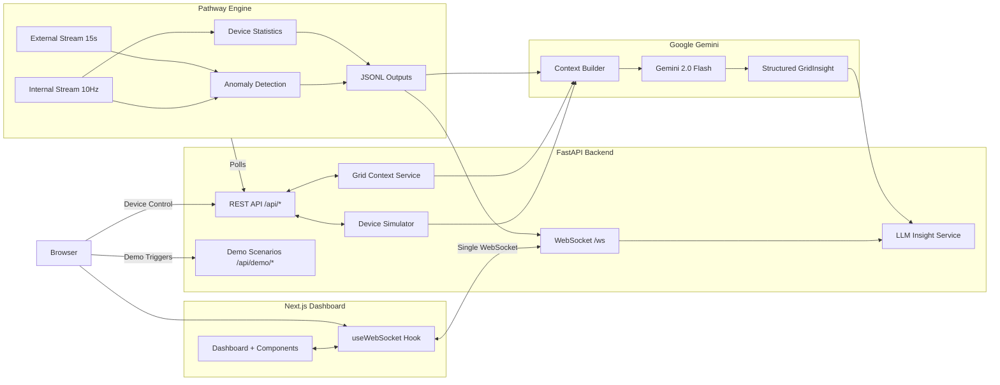
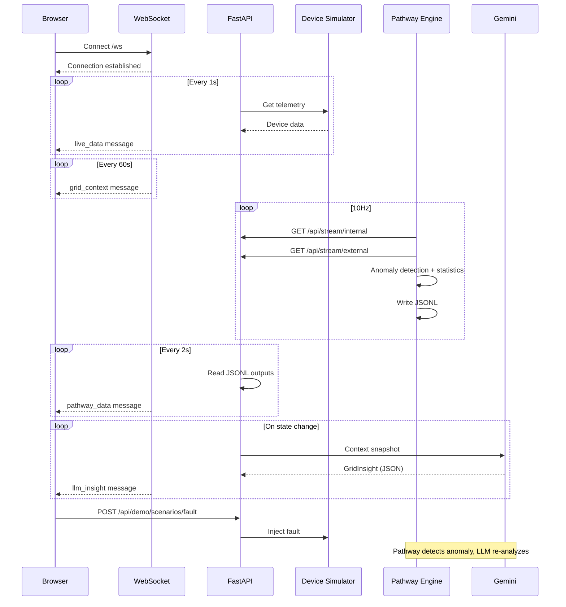

### GridSense AI -- Real-Time Energy Intelligence

GridSense AI is a real-time industrial energy monitoring and optimization platform. It fuses high-frequency device telemetry with external grid signals (pricing, carbon intensity, renewables) using Pathway for stream processing and Google Gemini for natural language insights -- giving operators instant visibility, fault detection, and context-aware recommendations in a single dashboard.

### Problem & Solution

- **The problem**: Industrial facilities lack real-time visibility into device behavior combined with grid conditions, causing:
    - **Peak demand penalties** from undetected demand spikes.
    - **Operational waste** from faulty equipment running unnoticed.
    - **Carbon blindness** -- no awareness of when the grid is clean vs. dirty.
- **The solution**: GridSense AI uses a two-layer intelligence stack:
    - **Pathway** processes dual data streams in real-time: device telemetry (10Hz) and grid context (pricing, carbon, renewables).
    - **Gemini** synthesizes Pathway's processed outputs into plain-language, quantified recommendations via context-augmented generation.

---

### System Architecture

The system is built as a streaming, WebSocket-driven architecture with five layers:

- **Digital Twin (Data Layer)**: Physics-based simulator generating realistic V/I/P telemetry for motor, HVAC, compressor, and lighting devices.
- **Pathway Engine (Stream Processing Layer)**: Real-time anomaly detection, device statistics, and temporal stream joining (device + grid via `asof_join`).
- **LLM Layer (Intelligence Layer)**: Gemini 2.0 Flash with structured JSON output. Receives Pathway-processed context and produces severity-tagged, quantified insights.
- **Control Plane (Application Layer)**: FastAPI backend with WebSocket push, REST device control, and demo scenario orchestration.
- **Dashboard (Presentation Layer)**: Next.js frontend with real-time metrics, charts, and a unified Pathway Analytics panel.



---

### System Workflow

The system runs four continuous data flows plus interactive controls:

- **1. WebSocket push (real-time)**
    - A single persistent WebSocket connection pushes four data streams to the dashboard:
        - **Live telemetry** every 1 second (device current, power, voltage, status).
        - **Grid context** every 60 seconds (carbon intensity, electricity price, renewable %).
        - **Pathway analytics** every 2 seconds (anomalies, device statistics).
        - **LLM insights** on change (pushed when Gemini generates a new insight).
    - Auto-reconnects with exponential backoff (1s to 16s). Green/red indicator in header.

- **2. Pathway stream processing**
    - Pathway polls the FastAPI server:
        - `GET /api/stream/internal` at 10Hz for device data.
        - `GET /api/stream/external` every 15s for grid context.
    - Performs real-time:
        - **Anomaly detection** -- filters current > 100A, classifies as inrush/fault/overcurrent.
        - **Device statistics** -- GroupBy aggregation per device type (avg/max current, avg power, sample count).
    - Results appended as JSONL under `pathway_output/`.

- **3. LLM insight generation (Gemini)**
    - Background service builds a context snapshot from: device telemetry, grid conditions, Pathway anomalies, and device statistics.
    - Calls Gemini 2.0 Flash with structured JSON schema (Pydantic `GridInsight` model).
    - **State fingerprinting**: only calls Gemini when the system state actually changes (device status, current bracket, pricing tier, or carbon level).
    - **Critical auto-trigger**: monitors for faults/overcurrent every 2s and triggers immediate re-analysis.
    - **Rate limit handling**: parses 429 retry delays and backs off automatically.
    - Returns: summary, severity, observations, actions, cost insight, carbon insight.

- **4. Device control & demo scenarios**
    - User triggers on/off/start/fault from the device table.
    - Demo panel provides one-click scenarios: Surge All, Motor Inrush, High Load, Normal Ops, Inject Fault, Reset.
    - Each scenario orchestrates multiple device state changes to showcase specific system capabilities.



---

### Dashboard Layout

Top to bottom:

1. **Header** -- System status badge (Normal/Warning/Critical) + WebSocket indicator (green dot) + clock.
2. **Demo Panel** -- Collapsible grid of 6 one-click scenario buttons with descriptions and capability tags.
3. **Metrics Grid** -- 6 KPI cards: Total Current, Total Power, Avg Voltage, Carbon Intensity, Renewable %, Electricity Price.
4. **Live Chart** -- Real-time area chart of total current (30-point rolling window). Turns red during critical conditions.
5. **Pathway Analytics Panel** -- Unified intelligence panel with:
    - AI Insight (Gemini-generated summary, severity, observations, actions, cost/carbon insights).
    - Recent Anomalies (fault/inrush/overcurrent alerts from Pathway).
    - Device Performance (per-device-type statistics).
6. **Device Table** -- Per-device status, current, power, voltage, with on/off controls.

---

### Demo Scenarios

| Scenario | What it does | What it showcases |
|---|---|---|
| **Surge All** | All devices on + motor fault (110A sustained) | Anomaly detection, fault alerts, critical status, LLM recommendations |
| **Motor Inrush** | Motor start: 120A peak, decays to 45A over 3.5s | Transient spike detection, real-time chart spike |
| **High Load** | Motor + HVAC + Compressor (~90A) | Warning status, cost optimization insights |
| **Normal Ops** | HVAC + Lighting only (~22A) | Normal status, optimal grid recommendations |
| **Inject Fault** | Locked rotor fault on motor (110A sustained) | Fault detection, critical alerts, safety-first recommendations |
| **Reset** | All devices off | Returns to idle baseline |

---

### Technology Stack

- **Frontend**: Next.js 16, React 19, TypeScript 5, Tailwind CSS 4, Recharts
- **Backend**: FastAPI, Python 3.11, Uvicorn (ASGI)
- **Stream Processing**: Pathway (real-time, incremental)
- **LLM**: Google Gemini 2.0 Flash (structured JSON output via Pydantic schema)
- **Communication**: WebSocket (single persistent connection, 4 data streams)
- **Simulation**: Physics-based device models (motor inrush curves, HVAC thermodynamics)

---

### Setup

**Backend:**

```bash
cd server
python -m venv venv
venv\Scripts\activate        # Windows
# source venv/bin/activate   # macOS/Linux
pip install -r requirements.txt
```

Create `server/.env`:

```
GEMINI_API_KEY=your_key_here
```

Get a key from [Google AI Studio](https://aistudio.google.com/apikey).

```bash
# Terminal 1: API server
fastapi dev main.py

# Terminal 2: Pathway processor
python run_pathway.py
```

**Frontend:**

```bash
cd client
bun install
bun dev
```

Dashboard at `http://localhost:3000`, API at `http://localhost:8000`.
